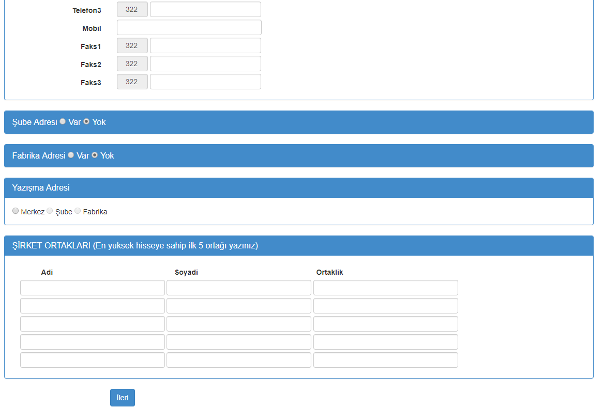

# FirmaOnKayit
Firmaların Ön Kayıt Sitesi

- Bu projenin amacı büyük boyutlu bir kayıt sayfasının 4 sayfaya ayrılmasını temel alır.
- Bu 4 sayfa, ajax ile asenkron çekilerek sayfanın ilk yüklenme hızını azaltmıştır. 
- Bunun yanında bu sayfaların validate işlemleri de 4'e bölünmüştür.
- Sayfa post işlemlerinde her sayfanın viewstate 'leri ayrı ayrı tutulması için tasarlanmıştır.

## Kurulum

- Database Model Entities çalışması için App_Data klasörü altında bulunan FirmaKayitDB'nin local MS-SQL Server'a bağlanması gerekmektedir.

## Sitenin 1. sayfası

